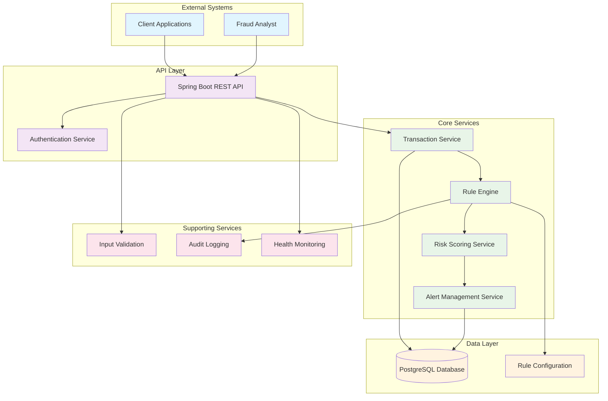
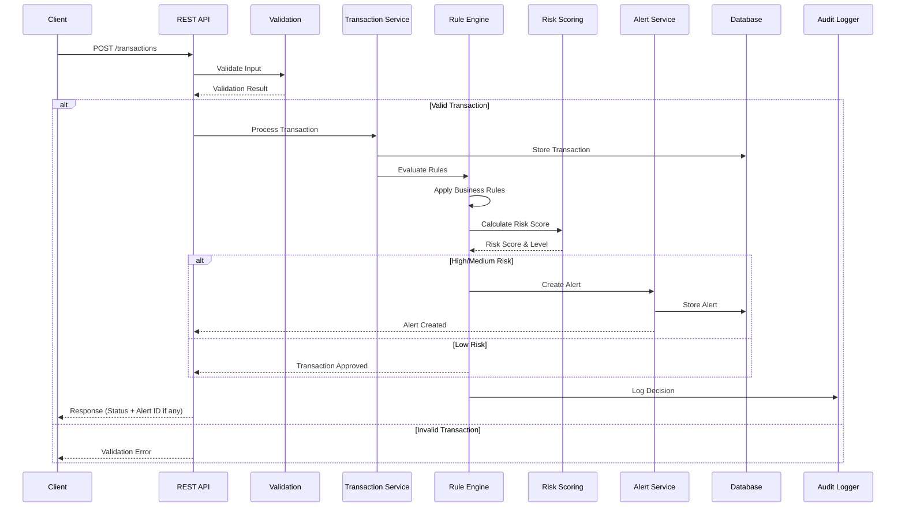
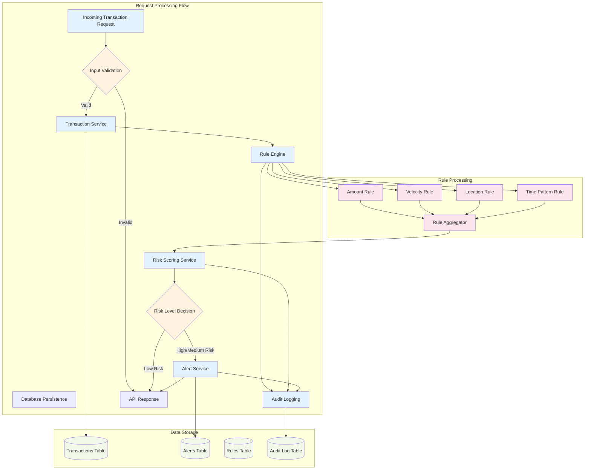
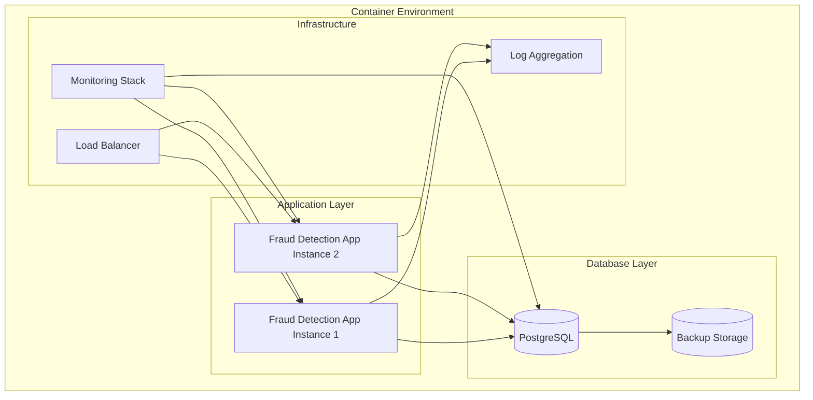

# Fraud Detection Engine MVP Architecture

## System Overview

This document outlines a simplified MVP architecture for a Fraud Detection Engine built with Java + Spring Boot, focusing on essential components for transaction processing, rule-based detection, and alert management.

## 1. High-Level Architecture



## 2. Data Flow Architecture



## 3. Component Interaction Details



## 4. Component Details

### 3.1 API Layer Components

#### REST API Controller
- **Endpoint**: `/transactions` (POST)
- **Endpoint**: `/alerts` (GET)
- **Endpoint**: `/alerts/{id}` (PATCH)
- **Endpoint**: `/rules` (GET, POST, PUT - Optional)
- **Features**: Request/Response validation, Error handling, API documentation

#### Authentication Service
- **Type**: API Key based authentication (Spring Security)
- **Features**: Request authentication, Rate limiting, Access control

### 3.2 Core Service Components

#### Transaction Service
- **Responsibilities**:
  - Transaction persistence
  - Data enrichment
  - Batch processing coordination
- **Features**: Transaction validation, Duplicate detection, Audit trail

#### Rule Engine
- **Rule Types**:
  - Amount threshold rules
  - Velocity rules (transaction frequency)
  - Geographic anomaly rules
  - Time-based pattern rules
- **Features**: Config-driven rules, Rule evaluation pipeline, Rule performance metrics

#### Risk Scoring Service
- **Scoring Method**: Weighted sum of triggered rules
- **Risk Levels**: Low (0-30), Medium (31-70), High (71-100)
- **Features**: Configurable weights, Score explanation, Historical scoring

#### Alert Management Service
- **Alert Lifecycle**: OPEN → REVIEWED → RESOLVED
- **Features**: Alert prioritization, Status updates, Alert queries with filters

### 3.3 Data Layer

#### Database Schema (PostgreSQL)

```sql
-- Transactions table
CREATE TABLE transactions (
    id UUID PRIMARY KEY,
    account_id VARCHAR(50) NOT NULL,
    amount DECIMAL(15,2) NOT NULL,
    currency VARCHAR(3) NOT NULL,
    merchant_id VARCHAR(50),
    merchant_category VARCHAR(20),
    location VARCHAR(100),
    timestamp TIMESTAMP NOT NULL,
    channel VARCHAR(20),
    device_id VARCHAR(50),
    created_at TIMESTAMP DEFAULT CURRENT_TIMESTAMP
);

-- Rules table
CREATE TABLE rules (
    id BIGSERIAL PRIMARY KEY,
    name VARCHAR(100) NOT NULL,
    description TEXT,
    rule_type VARCHAR(50) NOT NULL,
    parameters JSONB NOT NULL,
    weight INTEGER DEFAULT 10,
    active BOOLEAN DEFAULT true,
    created_at TIMESTAMP DEFAULT CURRENT_TIMESTAMP,
    updated_at TIMESTAMP DEFAULT CURRENT_TIMESTAMP
);

-- Alerts table
CREATE TABLE alerts (
    id UUID PRIMARY KEY,
    transaction_id UUID REFERENCES transactions(id),
    risk_score INTEGER NOT NULL,
    risk_level VARCHAR(10) NOT NULL,
    status VARCHAR(20) DEFAULT 'OPEN',
    triggered_rules JSONB NOT NULL,
    created_at TIMESTAMP DEFAULT CURRENT_TIMESTAMP,
    reviewed_at TIMESTAMP,
    resolved_at TIMESTAMP,
    reviewer_id VARCHAR(50),
    resolution_notes TEXT
);

-- Audit log table
CREATE TABLE audit_logs (
    id BIGSERIAL PRIMARY KEY,
    transaction_id UUID,
    action VARCHAR(50) NOT NULL,
    details JSONB,
    timestamp TIMESTAMP DEFAULT CURRENT_TIMESTAMP
);
```

## 4. API Endpoints Specification

### Transaction Processing
```http
POST /api/v1/transactions
Content-Type: application/json

{
  "accountId": "ACC123456",
  "amount": 1500.00,
  "currency": "USD",
  "merchantId": "MERCH789",
  "merchantCategory": "GROCERY",
  "location": "New York, NY",
  "timestamp": "2024-01-15T10:30:00Z",
  "channel": "ONLINE",
  "deviceId": "DEVICE123"
}
```

**Response:**
```json
{
  "transactionId": "tx-uuid-123",
  "status": "PROCESSED",
  "riskLevel": "MEDIUM",
  "alertId": "alert-uuid-456",
  "riskScore": 65,
  "triggeredRules": ["HIGH_AMOUNT", "UNUSUAL_LOCATION"]
}
```

### Alert Management
```http
GET /api/v1/alerts?status=OPEN&riskLevel=HIGH&page=0&size=20

PATCH /api/v1/alerts/{alertId}
{
  "status": "REVIEWED",
  "reviewerNotes": "Legitimate transaction confirmed with customer"
}
```

## 5. Technology Stack

### Core Framework
- **Java 17+**: Base language
- **Spring Boot 3.2+**: Application framework
- **Spring Data JPA**: Data access layer
- **Spring Security**: Authentication and authorization
- **Spring Boot Actuator**: Health monitoring and metrics

### Database
- **PostgreSQL**: Primary database (or H2 for development)
- **HikariCP**: Connection pooling
- **Flyway**: Database migrations

### Build and Deployment
- **Gradle**: Build tool
- **Docker**: Containerization
- **Docker Compose**: Local development environment

### Supporting Libraries
- **Lombok**: Reduce boilerplate code
- **Jackson**: JSON processing
- **SLF4J + Logback**: Logging
- **JUnit 5**: Testing framework
- **Testcontainers**: Integration testing

## 6. Configuration Examples

### Rule Configuration (YAML)
```yaml
rules:
  - name: "HIGH_AMOUNT"
    type: "AMOUNT_THRESHOLD"
    parameters:
      threshold: 1000.00
      currency: "USD"
    weight: 30
    active: true

  - name: "VELOCITY_CHECK"
    type: "TRANSACTION_FREQUENCY"
    parameters:
      maxTransactions: 5
      timeWindowMinutes: 60
    weight: 25
    active: true

  - name: "UNUSUAL_LOCATION"
    type: "GEOGRAPHIC_ANOMALY"
    parameters:
      maxDistanceKm: 100
      timeWindowHours: 2
    weight: 20
    active: true
```

## 7. Deployment Architecture



## 8. Implementation Roadmap

### Phase 1: Core MVP (Weeks 1-2)
- [ ] Set up Spring Boot project structure
- [ ] Implement basic transaction model and API
- [ ] Create PostgreSQL database schema
- [ ] Implement basic rule engine with 2-3 simple rules
- [ ] Basic alert creation and storage

### Phase 2: Enhanced Detection (Weeks 3-4)
- [ ] Add more sophisticated rules
- [ ] Implement risk scoring service
- [ ] Add alert management endpoints
- [ ] Implement batch transaction processing
- [ ] Add input validation and error handling

### Phase 3: Production Ready (Weeks 5-6)
- [ ] Add authentication and security
- [ ] Implement comprehensive logging
- [ ] Add health monitoring and metrics
- [ ] Docker containerization
- [ ] Performance testing and optimization

### Phase 4: Advanced Features (Future)
- [ ] Rule management UI
- [ ] Advanced analytics dashboard
- [ ] Machine learning integration
- [ ] External system integrations

## 9. Key Design Decisions

1. **Database Choice**: PostgreSQL for ACID compliance and JSON support for flexible rule parameters
2. **Rule Storage**: Database-stored rules with JSON parameters for flexibility
3. **API Design**: RESTful APIs with clear separation of concerns
4. **Security**: API key authentication for MVP, with OAuth2 as future enhancement
5. **Deployment**: Docker containers for consistency and scalability
6. **Monitoring**: Spring Actuator for basic health checks, with external monitoring integration points

This MVP architecture provides a solid foundation for a fraud detection system while maintaining simplicity and allowing for future enhancements.
