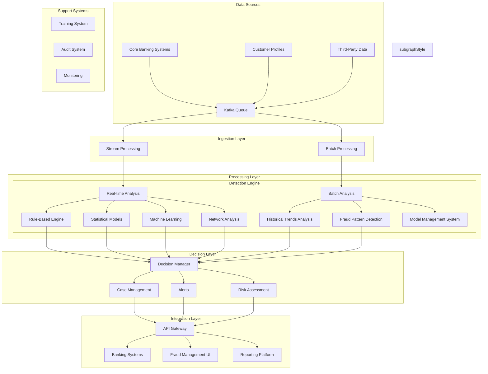

```mermaid
---
 init:
  theme: dark,
  background: #121212,
  themeVariables:
    primaryColor: #333333,
    primaryTextColor: #dddddd,
    primaryBorderColor: #444444,
    lineColor: #999999,
    secondaryColor: #222222,
    tertiaryColor: #191919,
    fontFamily: Arial,
    mainBkg: #333333,
    nodeBorder: #666666,
    clusterBkg: #222222,
    clusterBorder: #444444,
    textColor: #dddddd,
    fontSize: 16px,
    titleColor: #dddddd,
    edgeLabelBackground: #333333,
    nodeTextColor: #dddddd,
    noteBorderColor: #555555,
    noteBkgColor: #333333,
    fillColor: #333333,
    altBackground: #222222,
    secondBkg: #222222,
    backgroundColor: #121212,
    requirementBackground: #222222,
    subGraphBackground: #222222
  flowchart:
    curve: basis,
    useMaxWidth: false,
    htmlLabels: true,
    diagramPadding: 8
  look: default,
  layout: dagre
---
flowchart TD
 classDef subgraphStyle fill:#222222,stroke:#444444,color:#dddddd
 
 subgraph "Data Sources"
 CBS[Core Banking Systems] --> KQ[Kafka Queue]
 CP[Customer Profiles] --> KQ
 TPD[Third-Party Data] --> KQ
 end
 
 subgraph "Ingestion Layer"
 KQ --> ST[Stream Processing]
 KQ --> BT[Batch Processing]
 end
 
 subgraph "Processing Layer"
 ST --> RT[Real-time Analysis]
 BT --> BA[Batch Analysis]
 
 subgraph "Detection Engine"
  RT --> RB[Rule-Based Engine]
  RT --> SM[Statistical Models]
  RT --> ML[Machine Learning]
  RT --> NA[Network Analysis]
  
  BA --> HT[Historical Trends Analysis]
  BA --> FP[Fraud Pattern Detection]
  BA --> MM[Model Management System]
 end
 end
 
 subgraph "Decision Layer"
 RB --> DM[Decision Manager]
 SM --> DM
 ML --> DM
 NA --> DM
 HT --> DM
 FP --> DM
 
 DM --> CMS[Case Management]
 DM --> A[Alerts]
 DM --> RA[Risk Assessment]
 end
 
 subgraph "Integration Layer"
 CMS --> API[API Gateway]
 A --> API
 RA --> API
 
 API --> BS[Banking Systems]
 API --> FM[Fraud Management UI]
 API --> RP[Reporting Platform]
 end
 
 subgraph "Support Systems"
 TS[Training System]
 AUD[Audit System]
 MON[Monitoring]
 end
 
 class Data Sources; subgraphStyle
 class Ingestion Layer; subgraphStyle
 class Processing Layer; subgraphStyle
 class Detection Engine; subgraphStyle
 class Decision Layer; subgraphStyle
 class Integration Layer; subgraphStyle
 class Support Systems; subgraphStyle
```