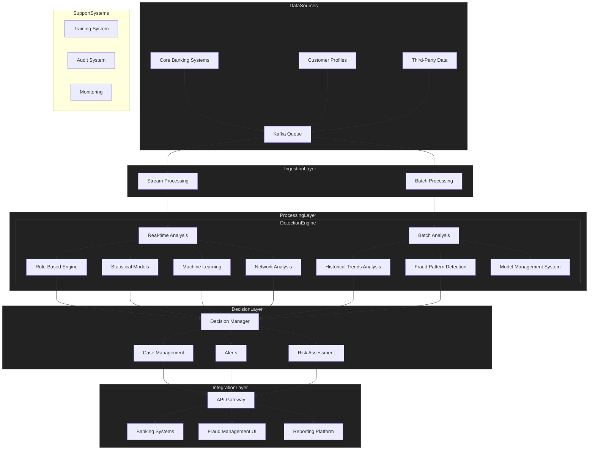

```mermaid
---
init:
  theme: dark,
  background: #121212,
  themeVariables:
    primaryColor: #333333,
    primaryTextColor: #dddddd,
    primaryBorderColor: #444444,
    lineColor: #999999,
    secondaryColor: #222222,
    tertiaryColor: #191919,
    fontFamily: Arial,
    mainBkg: #333333,
    nodeBorder: #555555,
    clusterBkg: #222222,
    clusterBorder: #444444,
    textColor: #dddddd,
    fontSize: 16px,
    titleColor: #dddddd,
    edgeLabelBackground: #333333,
    nodeTextColor: #dddddd,
    noteBorderColor: #555555,
    noteBkgColor: #333333,
    fillColor: #333333,
    altBackground: #222222,
    secondBkg: #222222,
    backgroundColor: #121212,
    requirementBackground: #222222,
    subGraphBackground: #222222
  flowchart:
    curve: basis,
    useMaxWidth: false,
    htmlLabels: true,
    diagramPadding: 8
  look: default,
  layout: dagre
---
flowchart TD
  classDef subgraphStyle fill:#222222,stroke:#444444,color:#dddddd

  subgraph DataSources
  CBS[Core Banking Systems] --> KQ[Kafka Queue]
  CP[Customer Profiles] --> KQ
  TPD[Third-Party Data] --> KQ
  end

  subgraph IngestionLayer
  KQ --> ST[Stream Processing]
  KQ --> BT[Batch Processing]
  end

  subgraph ProcessingLayer
  ST --> RT[Real-time Analysis]
  BT --> BA[Batch Analysis]

  subgraph DetectionEngine
    RT --> RB[Rule-Based Engine]
    RT --> SM[Statistical Models]
    RT --> ML[Machine Learning]
    RT --> NA[Network Analysis]

    %% Batch Analysis Outputs
    BA --> HT[Historical Trends Analysis]
    BA --> FP[Fraud Pattern Detection]
    BA --> MM[Model Management System]
  end
  end

  subgraph DecisionLayer
  RB --> DM[Decision Manager]
  SM --> DM
  ML --> DM
  NA --> DM
  HT --> DM
  FP --> DM

  DM --> CMS[Case Management]
  DM --> A[Alerts]
  DM --> RA[Risk Assessment]
  end

  subgraph IntegrationLayer
  CMS --> API[API Gateway]
  A --> API
  RA --> API

  API --> BS[Banking Systems]
  API --> FM[Fraud Management UI]
  API --> RP[Reporting Platform]
  end

  subgraph SupportSystems
  TS[Training System]
  AUD[Audit System]
  MON[Monitoring]
  end

class DataSources subgraphStyle
class IngestionLayer subgraphStyle
class ProcessingLayer subgraphStyle
class DetectionEngine subgraphStyle
class DecisionLayer subgraphStyle
class IntegrationLayer subgraphStyle
```