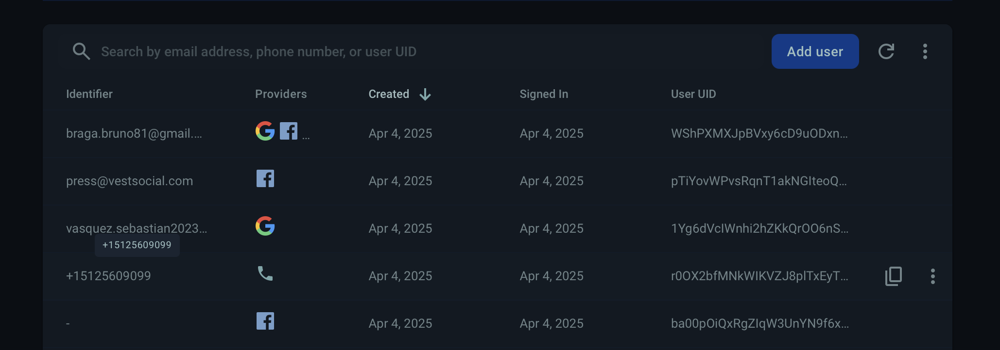
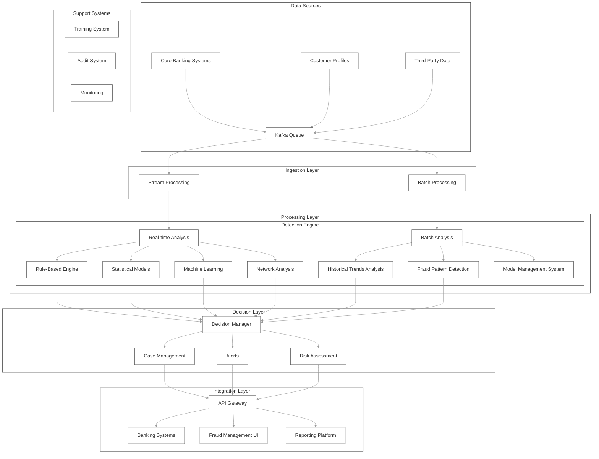
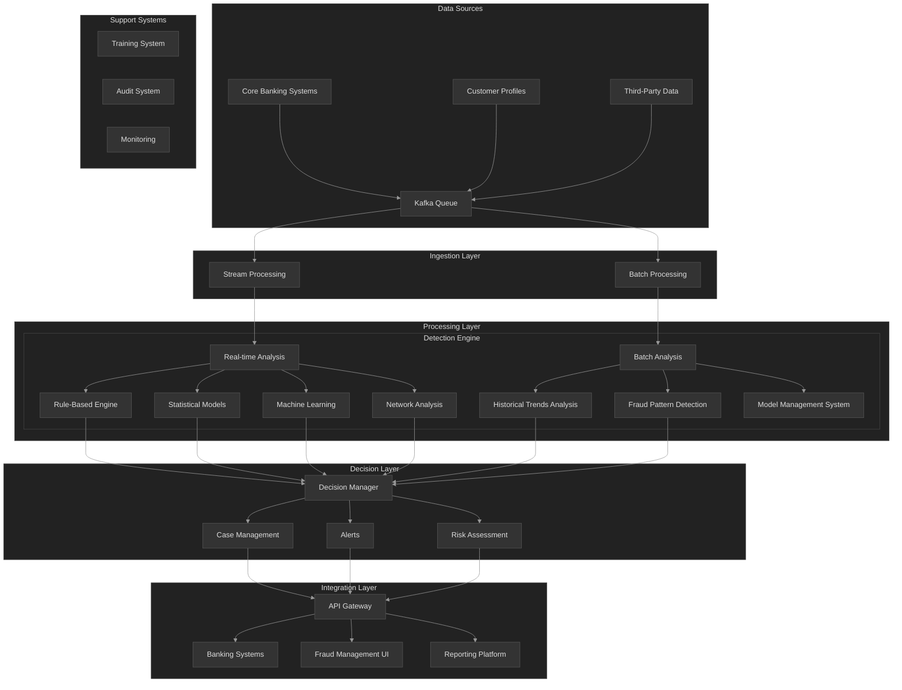

# Financial Transaction Fraud Detection System Architecture

## 1. System Overview

The system will be a robust, scalable financial transaction fraud detection platform capable of handling millions of transactions daily. It will employ a hybrid approach combining rule-based detection, statistical models, machine learning algorithms, and network analysis techniques to identify potential fraud in real-time and through batch analysis.

## 2. High-Level Architecture

```mermaid
%%{
```

## 3. Architecture Components

### 3.1 Data Ingestion Layer

- **Kafka-based Message Queue**: High-throughput distributed messaging system to handle millions of transactions
- **Stream Processing Engine**: For real-time transaction processing (Apache Kafka Streams or Apache Flink)
- **Batch Processing System**: For processing historical data and model training (Apache Spark)
- **API Connectors**: To integrate with core banking systems and third-party data providers

### 3.2 Detection Engine

- **Rule-Based Engine**:
  - Configurable rules with thresholds for quick, deterministic fraud checks
  - Rules management system for business users to modify rules without code changes
  
- **Statistical Models**:
  - Anomaly detection based on statistical methods
  - Customer profiling and behavioral analytics
  
- **Machine Learning Components**:
  - Supervised ML for known fraud patterns
  - Unsupervised ML for anomaly detection
  - Deep learning for complex pattern recognition
  - Feature engineering pipeline
  
- **Network Analysis**:
  - Graph database for relationship mapping
  - Algorithms to detect fraud rings and collusion
  - Link analysis visualization

### 3.3 Decision Layer

- **Scoring Engine**: To combine outputs from different detection methods
- **Case Management System**: For fraud analysts to review and resolve alerts
- **Alert Management**: Prioritization and routing of alerts
- **Workflow Engine**: To manage the investigation process

### 3.4 Integration & Presentation Layer

- **API Gateway**: RESTful APIs for integration with other systems
- **Admin Dashboard**: For configuration and monitoring
- **Analyst Workbench**: UI for fraud investigation
- **Reporting System**: For compliance and business intelligence

### 3.5 Support Systems

- **Model Training Pipeline**: For continuous model improvement
- **Audit System**: For compliance with regulations
- **Monitoring & Alerting**: For system health and performance

## 4. Data Flow Architecture



## 3. Architecture Components

### 3.1 Data Ingestion Layer

- **Kafka-based Message Queue**: High-throughput distributed messaging system to handle millions of transactions
- **Stream Processing Engine**: For real-time transaction processing (Apache Kafka Streams or Apache Flink)
- **Batch Processing System**: For processing historical data and model training (Apache Spark)
- **API Connectors**: To integrate with core banking systems and third-party data providers

### 3.2 Detection Engine

- **Rule-Based Engine**:
  - Configurable rules with thresholds for quick, deterministic fraud checks
  - Rules management system for business users to modify rules without code changes
  
- **Statistical Models**:
  - Anomaly detection based on statistical methods
  - Customer profiling and behavioral analytics
  
- **Machine Learning Components**:
  - Supervised ML for known fraud patterns
  - Unsupervised ML for anomaly detection
  - Deep learning for complex pattern recognition
  - Feature engineering pipeline
  
- **Network Analysis**:
  - Graph database for relationship mapping
  - Algorithms to detect fraud rings and collusion
  - Link analysis visualization

### 3.3 Decision Layer

- **Scoring Engine**: To combine outputs from different detection methods
- **Case Management System**: For fraud analysts to review and resolve alerts
- **Alert Management**: Prioritization and routing of alerts
- **Workflow Engine**: To manage the investigation process

### 3.4 Integration & Presentation Layer

- **API Gateway**: RESTful APIs for integration with other systems
- **Admin Dashboard**: For configuration and monitoring
- **Analyst Workbench**: UI for fraud investigation
- **Reporting System**: For compliance and business intelligence

### 3.5 Support Systems

- **Model Training Pipeline**: For continuous model improvement
- **Audit System**: For compliance with regulations
- **Monitoring & Alerting**: For system health and performance

## 4. Data Flow Architecture



## 5. Technology Stack

### 5.1 Data Storage

- **Operational Database**: PostgreSQL (transaction data)
- **Data Warehouse**: Snowflake/BigQuery (historical data)
- **Graph Database**: Neo4j (network analysis)
- **Cache**: Redis (high-speed lookup)

### 5.2 Processing & Analytics

- **Stream Processing**: Apache Kafka, Kafka Streams
- **Batch Processing**: Apache Spark
- **ML Framework**: TensorFlow, Scikit-learn, XGBoost
- **Graph Analytics**: Neo4j Graph Data Science

### 5.3 Infrastructure

- **Containerization**: Docker
- **Orchestration**: Kubernetes
- **Cloud Platform**: AWS/Azure/GCP services
- **CI/CD**: Jenkins, GitHub Actions

### 5.4 Monitoring & Logging

- **System Monitoring**: Prometheus, Grafana
- **Log Management**: ELK Stack (Elasticsearch, Logstash, Kibana)
- **Application Performance**: New Relic/Datadog

## 6. Security & Compliance Framework

### 6.1 Data Security

- Encryption at rest and in transit (meeting PCI DSS requirements)
- Tokenization of sensitive data
- Access control using OAuth 2.0 and OpenID Connect
- Secrets management using HashiCorp Vault or AWS Secrets Manager

### 6.2 Compliance

- Auditability of all decisions (for GDPR compliance)
- Explainability module for ML decisions
- Data retention policies aligned with regulatory requirements
- Data anonymization for model training

### 6.3 Privacy

- Data minimization principles
- Purpose limitation controls
- GDPR compliance for user data
- Consent management

## 7. Implementation Approach

### 7.1 Phase 1: Foundation

- Core infrastructure setup
- Basic rule-based engine
- Integration with primary data sources
- MVP case management

### 7.2 Phase 2: Advanced Analytics

- Statistical models implementation
- Initial ML models deployment
- Historical data analysis
- Enhanced API integration

### 7.3 Phase 3: Full Capability

- Network analysis implementation
- Advanced ML model deployment
- Complete third-party integration
- Comprehensive reporting

## 8. Scalability & Performance

### 8.1 Horizontal Scalability

- Containerized microservices architecture
- Auto-scaling based on transaction volume
- Distributed processing for ML inference

### 8.2 Performance Optimization

- In-memory processing for real-time decisions
- Time-based partitioning of historical data
- Optimized ML model serving with caching

## 9. Monitoring & Operations

### 9.1 System Monitoring

- Real-time metrics on system performance
- Alert thresholds for latency and error rates
- Service health dashboards

### 9.2 Business Metrics

- False positive/negative rates
- Fraud detection success rate
- Financial impact reporting

## 10. Key Considerations & Challenges

### 10.1 Technical Challenges

- Maintaining low latency with complex ML models
- Balancing false positives vs. false negatives
- Keeping pace with evolving fraud techniques

### 10.2 Operational Challenges

- Model drift and continuous retraining
- Managing alert volume for analysts
- Compliance with evolving regulations

### 10.3 Success Factors

- Regular model retraining and evaluation
- Thorough testing with fraud scenarios
- Close collaboration between data scientists and fraud analysts
