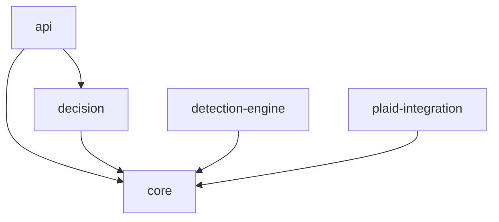

# Fraud Detection System: Dependency Analysis

## Module Dependency Structure



## Identified Dependency Issues

### 1. Inconsistent Version Management

| Module | Issue | Impact |
|--------|-------|--------|
| api | Uses explicit versions for all dependencies | May conflict with transitive dependencies |
| detection-engine | Uses explicit versions for ML libraries | Version conflicts with other Spring components |
| core | Uses explicit version for Jackson | May conflict with Spring's managed version |
| plaid-integration | Uses Spring BOM but without versions | Can lead to unpredictable behavior |

### 2. Lombok Configuration Inconsistencies

The core module includes Lombok as both implementation and compileOnly dependencies:

```kotlin
implementation("org.projectlombok:lombok:1.18.30")
compileOnly("org.projectlombok:lombok:1.18.30")
```

This double declaration can cause issues at runtime as Lombok should only be available at compile time.

### 3. Spring Boot Dependency Management Issues

| Module | Spring Management | Issue |
|--------|-------------------|-------|
| api | Direct dependencies | Not using the recommended Spring Boot BOM approach |
| decision | Direct dependencies | Not using the recommended Spring Boot BOM approach |
| detection-engine | Direct dependencies | May conflict with transitive dependencies |
| plaid-integration | Uses BOM | More consistent, but needs version management |

### 4. Third-Party Library Conflicts

The detection-engine module includes several ML libraries that may have conflicting transitive dependencies:

```kotlin
implementation("org.tensorflow:tensorflow-core-platform:0.5.0")
implementation("org.deeplearning4j:deeplearning4j-core:1.0.0-M1.1")
implementation("org.nd4j:nd4j-native-platform:1.0.0-M1.1")
```

These libraries often have complex dependency graphs that can conflict with each other or with Spring Boot components.

### 5. Missing Jakarta EE Dependencies

Missing or conflicting Jakarta EE dependencies can cause issues, especially when mixing different versions:

```kotlin
implementation("jakarta.validation:jakarta.validation-api:3.0.2")
```

## Dependency Resolution Strategy

### 1. Standardize on Spring Boot BOM

```kotlin
// In root build.gradle.kts
allprojects {
    apply(plugin = "io.spring.dependency-management")
    
    the<io.spring.gradle.dependencymanagement.dsl.DependencyManagementExtension>().apply {
        imports {
            mavenBom("org.springframework.boot:spring-boot-dependencies:3.2.4")
        }
    }
}
```

### 2. Create a Versions Catalog

```kotlin
// In gradle/libs.versions.toml
[versions]
springBoot = "3.2.4"
springDependencyManagement = "1.1.4"
lombok = "1.18.30"
jackson = "2.16.0"
junit = "5.11.3"
plaid = "16.6.0"

[libraries]
spring-boot-starter = { module = "org.springframework.boot:spring-boot-starter", version.ref = "springBoot" }
spring-boot-starter-web = { module = "org.springframework.boot:spring-boot-starter-web", version.ref = "springBoot" }
lombok = { module = "org.projectlombok:lombok", version.ref = "lombok" }
```

### 3. Consistency in Dependency Declaration

Ensure all modules use the same approach to declaring dependencies:

```kotlin
dependencies {
    // Use consistent approach
    implementation(libs.spring.boot.starter)
    compileOnly(libs.lombok)
    annotationProcessor(libs.lombok)
}
```

## Module-Specific Recommendations

### Core Module

```kotlin
dependencies {
    // Remove implementation dependency, keep only compileOnly
    // implementation("org.projectlombok:lombok:1.18.30") - REMOVE THIS
    compileOnly(libs.lombok)
    annotationProcessor(libs.lombok)
    
    // Use managed versions from Spring Boot BOM
    implementation("jakarta.validation:jakarta.validation-api")
    implementation("com.fasterxml.jackson.core:jackson-annotations")
    implementation("com.fasterxml.jackson.core:jackson-databind")
}
```

### API Module

```kotlin
dependencies {
    implementation(project(":core"))
    implementation(project(":decision"))
    
    // Use managed versions
    implementation("org.springframework.boot:spring-boot-starter-web")
    implementation("org.springframework.boot:spring-boot-starter-validation")
    implementation("org.springdoc:springdoc-openapi-starter-webmvc-ui:2.3.0") // Version not in Spring BOM
}
```

### Detection Engine Module

Split the ML dependencies into a separate configuration to minimize conflicts:

```kotlin
configurations {
    create("mlLibraries")
}

dependencies {
    implementation(project(":core"))
    
    // ML Libraries in separate configuration
    "mlLibraries"("org.tensorflow:tensorflow-core-platform:0.5.0")
    "mlLibraries"("org.deeplearning4j:deeplearning4j-core:1.0.0-M1.1")
    "mlLibraries"("org.nd4j:nd4j-native-platform:1.0.0-M1.1")
    
    // Regular dependencies use managed versions
    implementation("org.springframework.boot:spring-boot-starter")
}
```

## Specific Resolution for Plaid Integration Issue

The clean_build.sh script attempts to handle Plaid version issues. A more robust approach would be:

```kotlin
// In plaid-integration/build.gradle.kts
repositories {
    mavenCentral()
    maven {
        url = uri("https://jitpack.io")
    }
}

// Add fallback resolution
configurations.all {
    resolutionStrategy {
        eachDependency {
            if (requested.group == "com.plaid" && requested.name == "plaid-java") {
                val latestVersion = findLatestPlaidVersion()
                useVersion(latestVersion ?: "16.6.0")
            }
        }
    }
}

// Helper function to find latest Plaid version
fun findLatestPlaidVersion(): String? {
    // Implementation to query Maven Central
}
```

## Implementation Summary

To resolve all dependency issues:

1. **Create a Standardized Version Management System**
   - Define all versions in a single location
   - Apply consistent version management across all modules

2. **Normalize Lombok Usage**
   - Use only compileOnly + annotationProcessor, not implementation

3. **Use Spring BOM Consistently**
   - Apply Spring Boot dependency management to all modules
   - Minimize explicit version declarations

4. **Isolate Complex Dependencies**
   - Use separate configurations for ML libraries
   - Apply stricter resolution strategies for problematic dependencies

5. **Implement Dependency Verification**
   - Add dependency verification to catch issues early
   - Create more detailed dependency reports in the build process