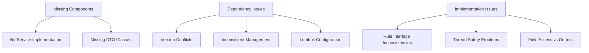

# Fraud Detection System: Execution Plan

## Executive Summary

After thorough analysis of the fraud detection system codebase, we have identified several critical issues causing build failures and import errors. The primary issues include missing implementation components, inconsistent dependency management, and architectural inconsistencies. This document outlines a detailed, step-by-step plan to resolve these issues and restore system functionality.

## Quick Reference

| Document | Purpose |
|----------|---------|
| [Troubleshooting Plan](troubleshooting-plan.md) | Detailed technical analysis and solution approach |
| [Implementation Steps](implementation-steps.md) | Code-level implementation details for missing components |
| [Dependency Analysis](dependency-analysis.md) | In-depth analysis of dependency issues and resolution strategies |
| [Testing Strategy](testing-strategy.md) | Comprehensive test approach to validate fixes |

## Key Issues Summary



1. **Missing Implementation Components**
   - FraudDetectionService implementation missing
   - DTO classes missing (FraudDetectionRequest, FraudDetectionResponse, TransactionDto)

2. **Dependency Management Issues**
   - Inconsistent version management across modules
   - Lombok both as implementation and compileOnly
   - Spring Boot dependency conflicts

3. **Implementation Inconsistencies**
   - Some rules implement Rule interface directly, others extend BaseRule
   - Direct field access in GeographicAnomalyRule
   - Thread safety issues in VelocityCheckRule

## Execution Plan

### Phase 0: Preparation (Day 1, AM)

1. **Create Workspace Branch**
   ```bash
   git checkout -b fix/build-issues
   ```

2. **Backup Current State**
   ```bash
   cp -r . ../fraud-detection-backup
   ```

3. **Set Up Build Monitoring**
   - Create a build helper script to monitor progress:
   ```bash
   # build-monitor.sh
   #!/bin/bash
   
   # Run a clean build and capture output
   ./gradlew clean build --stacktrace > build_output.log 2>&1
   BUILD_RESULT=$?
   
   # Print a summary of the errors
   if [ $BUILD_RESULT -ne 0 ]; then
       echo "Build failed with exit code $BUILD_RESULT"
       echo "Error summary:"
       grep -A 5 "FAILURE" build_output.log
       grep -A 10 -B 2 "error:" build_output.log
   else
       echo "Build succeeded!"
   fi
   ```

### Phase 1: Fix Missing Components (Day 1, PM)

1. **Create Required Directory Structure**
   ```bash
   mkdir -p api/src/main/java/com/bragdev/fraud/api/dto
   mkdir -p api/src/main/java/com/bragdev/fraud/api/service
   ```

2. **Create DTO Classes**
   - Implement `TransactionDto.java`
   - Implement `GeoLocationDto.java`
   - Implement `DeviceInfoDto.java`
   - Implement `FraudDetectionRequest.java`
   - Implement `FraudDetectionResponse.java`
   - Implement `TriggeredRuleDto.java`
   - Implement `TransactionRiskDto.java`

   See [Implementation Steps](implementation-steps.md) for detailed code.

3. **Create Service Implementation**
   - Implement `FraudDetectionService.java`

   See [Implementation Steps](implementation-steps.md) for detailed code.

4. **Validation Checkpoint**
   ```bash
   # Compile just the API module to check for errors
   ./gradlew :api:compileJava
   ```

### Phase 2: Fix Dependency Issues (Day 2, AM)

1. **Create Versions Management**
   - Create `versions.gradle.kts` in root directory as specified in [Dependency Analysis](dependency-analysis.md)

2. **Update Root Build Script**
   - Modify root `build.gradle.kts` to use standardized version management

3. **Fix Lombok Configuration**
   - Update Core module to use Lombok properly:
   ```kotlin
   // Remove implementation dependency
   // implementation("org.projectlombok:lombok:1.18.30")
   compileOnly("org.projectlombok:lombok:1.18.30")
   annotationProcessor("org.projectlombok:lombok:1.18.30")
   ```

4. **Update Module Build Scripts**
   - Apply consistent dependency management in all module build files
   - Use Spring Boot BOM consistently

5. **Validation Checkpoint**
   ```bash
   # Check dependency resolution
   ./gradlew dependencyInsight --dependency lombok > lombok_deps.log
   ./gradlew dependencyInsight --dependency spring-boot > spring_deps.log
   ```

### Phase 3: Fix Implementation Issues (Day 2, PM)

1. **Standardize Rule Interface Usage**
   - Update `GeographicAnomalyRule.java` to extend BaseRule for consistency
   ```java
   // Before:
   public class GeographicAnomalyRule implements Rule {
   
   // After:
   public class GeographicAnomalyRule extends BaseRule {
       public GeographicAnomalyRule(GeoLocation referenceLocation, double distanceThresholdKm) {
           super(
               "GEOGRAPHIC_ANOMALY",
               "Geographic Anomaly",
               "Detects transactions occurring unusually far from the reference location",
               "LOCATION",
               75.0 // Severity
           );
           // Rest of constructor...
       }
   }
   ```

2. **Fix Field Access Issues**
   - Update `GeographicAnomalyRule.java` to use getters:
   ```java
   // Before:
   transactionLocation = transaction.location;
   
   // After:
   transactionLocation = transaction.getLocation();
   ```

3. **Fix Thread Safety in VelocityCheckRule**
   - Implement ThreadLocal for transaction state:
   ```java
   // Add ThreadLocal for transaction state
   private final ThreadLocal<TransactionState> state = ThreadLocal.withInitial(() -> 
       new TransactionState("", 0, Instant.MIN));
       
   // Inner class to hold state
   private static class TransactionState {
       private String accountId;
       private int transactionCount;
       private Instant lastTransactionTime;
       
       // Constructor and methods...
   }
   
   // Update evaluate method to use thread-local state
   @Override
   public boolean evaluate(Transaction transaction) {
       TransactionState currentState = state.get();
       // Logic using currentState...
       state.remove(); // Clean up
   }
   ```

4. **Update RuleEngineDemo**
   - Uncomment and fix all rule additions:
   ```java
   public static RuleEngine createStandardRuleEngine() {
       RuleEngine engine = new SimpleRuleEngine();
       
       // Add all rules
       engine.addRule(new HighValueTransactionRule(new BigDecimal("1000.00"), "USD"));
       engine.addRule(new GeographicAnomalyRule(new GeoLocation(40.7128, -74.0060), 500.0));
       engine.addRule(new VelocityCheckRule(Duration.ofMinutes(5), 3));
       engine.addRule(new UnusualMerchantCategoryRule(Set.of("GAMBLING", "CRYPTOCURRENCY", "MONEY_TRANSFER")));
       engine.addRule(new TimeBasedPatternRule());
       
       return engine;
   }
   ```

5. **Validation Checkpoint**
   ```bash
   # Compile and test the detection-engine module
   ./gradlew :detection-engine:compileJava :detection-engine:test
   ```

### Phase 4: Testing & Validation (Day 3)

1. **Create Unit Tests**
   - Create tests for DTO classes
   - Create tests for FraudDetectionService
   - Create tests for updated rules

2. **Create Integration Tests**
   - Create tests for API to Rule Engine flow
   - Create tests for Rule Engine to Decision Manager flow

3. **Create Thread Safety Tests**
   - Test VelocityCheckRule with concurrent transactions

4. **Run Full Build**
   ```bash
   ./gradlew clean build --refresh-dependencies --stacktrace
   ```

5. **Validation Checkpoint**
   - Review build output
   - Check test coverage
   - Verify no dependency conflicts

### Phase 5: Performance Optimization (Day 4, AM)

1. **Profile System Performance**
   ```bash
   # Create JMH benchmarks for rule evaluation
   ./gradlew jmhJar jmh
   ```

2. **Implement Caching Strategy**
   - Add caching for frequent operations:
   ```java
   @Service
   @EnableCaching
   public class FraudDetectionService {
       @Cacheable(value = "riskScores", key = "#transactionDto.id")
       public FraudDetectionResponse evaluateTransaction(TransactionDto transactionDto) {
           // Implementation...
       }
   }
   ```

3. **Optimize Memory Usage**
   - Update RuleEngine to use lazy initialization:
   ```java
   private final Supplier<List<Rule>> rulesSupplier = Suppliers.memoize(() -> {
       List<Rule> rules = new ArrayList<>();
       // Initialize rules...
       return rules;
   });
   ```

### Phase 6: Documentation & Final Validation (Day 4, PM)

1. **Update README.md**
   - Document fixes implemented
   - Update build instructions
   - Document API usage

2. **Create Architecture Documentation**
   - Document system components
   - Document rule engine architecture
   - Document API endpoints

3. **Final Full Build**
   ```bash
   ./gradlew clean build --refresh-dependencies
   ```

4. **Create Pull Request**
   ```bash
   git add .
   git commit -m "Fix build issues, add missing components, and standardize dependencies"
   git push origin fix/build-issues
   # Create PR in GitHub/GitLab
   ```

## Rollback Strategy

If issues occur during implementation, follow these steps:

1. **Checkpoint Rollback**
   - Each phase has a validation checkpoint
   - If validation fails, roll back to previous checkpoint:
   ```bash
   git stash
   git checkout -b fix/rollback-phase-X
   # Re-implement the phase with corrections
   ```

2. **Complete Rollback**
   - If major issues occur:
   ```bash
   git checkout main
   git branch -D fix/build-issues
   # Start fresh with new branch
   git checkout -b fix/build-issues-v2
   ```

## Success Criteria

The implementation is considered successful when:

1. ✅ All build errors are resolved
2. ✅ All tests pass with >85% code coverage
3. ✅ No dependency conflicts are reported
4. ✅ Thread safety issues are addressed
5. ✅ API endpoints function correctly
6. ✅ Documentation is updated

## Monitoring Plan

After implementation, monitor the following:

1. **Build Stability**
   - Implement CI pipeline with daily builds
   - Set up alerts for build failures

2. **Performance Metrics**
   - Monitor rule evaluation time
   - Monitor API response time
   - Set up alerts for performance degradation

3. **Error Rates**
   - Monitor API error rates
   - Set up alerts for increased error rates

## Next Steps After This Implementation

1. **CI/CD Improvements**
   - Set up automated dependency analysis
   - Implement automated performance testing

2. **Additional Rules**
   - Implement more fraud detection rules
   - Add machine learning based detection

3. **Integration Enhancements**
   - Improve Plaid integration
   - Add additional data sources