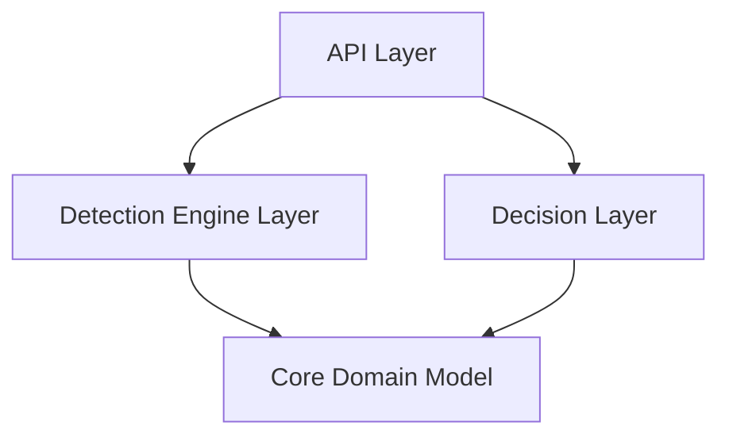

# Fraud Detection System: Executive Summary

## Problem Statement

The fraud detection system is currently experiencing build failures, import errors, and dependency conflicts. These issues prevent successful compilation and proper functioning of the system. A comprehensive analysis has identified several root causes:

1. **Missing implementation components**
2. **Inconsistent dependency management**
3. **Implementation inconsistencies**
4. **Thread safety issues**

## Key Documents

We've prepared a suite of comprehensive documentation to address these issues:

| Document | Purpose | Key Sections |
|----------|---------|--------------|
| [Troubleshooting Plan](troubleshooting-plan.md) | Technical analysis and solution approach | Identified Issues, Solution Plan, Implementation Timeline |
| [Implementation Steps](implementation-steps.md) | Code-level implementation details | DTO Classes, Service Implementation, Build Configuration |
| [Dependency Analysis](dependency-analysis.md) | Dependency issue resolution | Module Dependencies, Version Conflicts, Resolution Strategy |
| [Testing Strategy](testing-strategy.md) | Testing approach | Unit Tests, Integration Tests, Thread Safety Tests |
| [Execution Plan](execution-plan.md) | Implementation roadmap | Phase-by-phase Plan, Validation Checkpoints, Rollback Strategy |
| [Architecture Overview](fraud-detection-architecture.md) | System visualization | Component Diagrams, Data Flow, Package Structure |

## System Architecture

The fraud detection system follows a layered architecture:

- **API Layer**: Handles HTTP requests, DTO conversion, and orchestration
- **Detection Engine**: Contains fraud detection rules and rule engine
- **Decision Layer**: Combines scores from multiple sources to make final decision
- **Core Domain Model**: Defines the domain objects and interfaces

## Root Cause Analysis

1. **Missing Implementation Components**
   - The `FraudDetectionController` references a `FraudDetectionService` that doesn't exist
   - Required DTO classes (`FraudDetectionRequest`, `FraudDetectionResponse`, `TransactionDto`) are missing

2. **Dependency Management Issues**
   - Inconsistent version management across modules
   - Lombok configured as both implementation and compileOnly
   - Potential conflicts in Spring Boot dependencies

3. **Implementation Inconsistencies**
   - Some rules implement the `Rule` interface directly while others extend `BaseRule`
   - Direct field access instead of getter usage in `GeographicAnomalyRule`

4. **Thread Safety Issues**
   - `VelocityCheckRule` maintains state without thread safety mechanisms

## Solution Overview

Our comprehensive solution addresses all identified issues:

1. **Missing Components**
   - Create required DTO classes (7 classes)
   - Implement `FraudDetectionService` with proper conversion methods

2. **Dependency Management**
   - Create centralized version management
   - Standardize Spring Boot BOM usage
   - Fix Lombok configuration

3. **Implementation Standardization**
   - Standardize rule implementations
   - Fix field access patterns
   - Implement thread-safe state management

4. **Comprehensive Testing**
   - Create unit tests for new components
   - Implement integration tests for complete flow
   - Add thread safety tests

## Implementation Timeline

The solution will be implemented in a 4-day timeline:

**Day 1**: Fix missing components and create directory structure
**Day 2**: Standardize dependencies and fix implementation inconsistencies
**Day 3**: Create tests and validate solutions
**Day 4**: Performance optimization and documentation

## Key Benefits

1. **Restored System Functionality**
   - Successful builds with no errors
   - Complete API layer implementation

2. **Improved Code Quality**
   - Consistent implementation patterns
   - Thread-safe components

3. **Better Dependency Management**
   - Centralized version control
   - Reduced conflict potential

4. **Enhanced Maintainability**
   - Comprehensive documentation
   - Better testability

## Next Steps

After implementing the proposed fixes:

1. **Switch to Implementation Mode**
   - We recommend switching to Code mode to implement the proposed solutions.
   - The code implementation should follow the detailed steps in the documents.

2. **Continuous Improvement**
   - Once the system is operational, consider implementing additional fraud detection rules.
   - Enhance the test suite for better coverage.
   - Set up continuous integration for early detection of build issues.

## Conclusion

The fraud detection system is experiencing build failures due to missing components, dependency issues, and implementation inconsistencies. Our comprehensive solution addresses all these issues with a detailed implementation plan, standardized approach, and thorough testing strategy. By following the proposed execution plan, the system can be restored to full functionality within a 4-day timeframe.