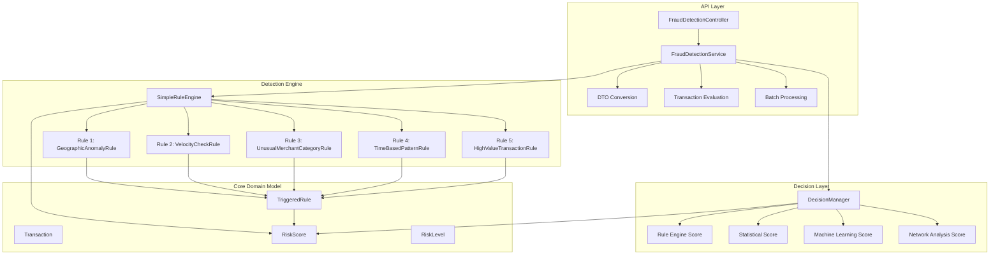
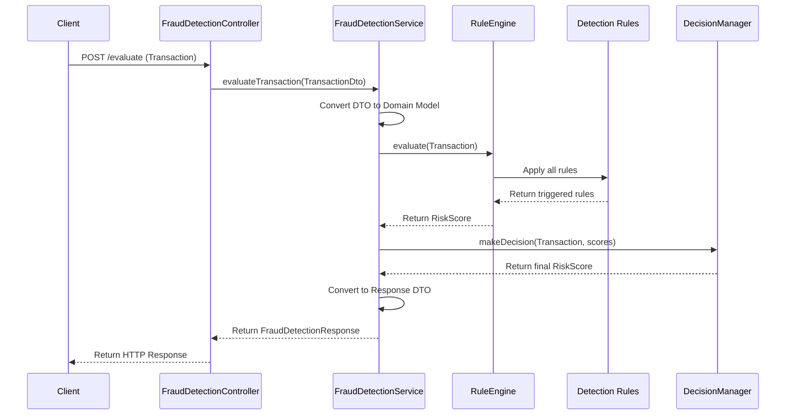
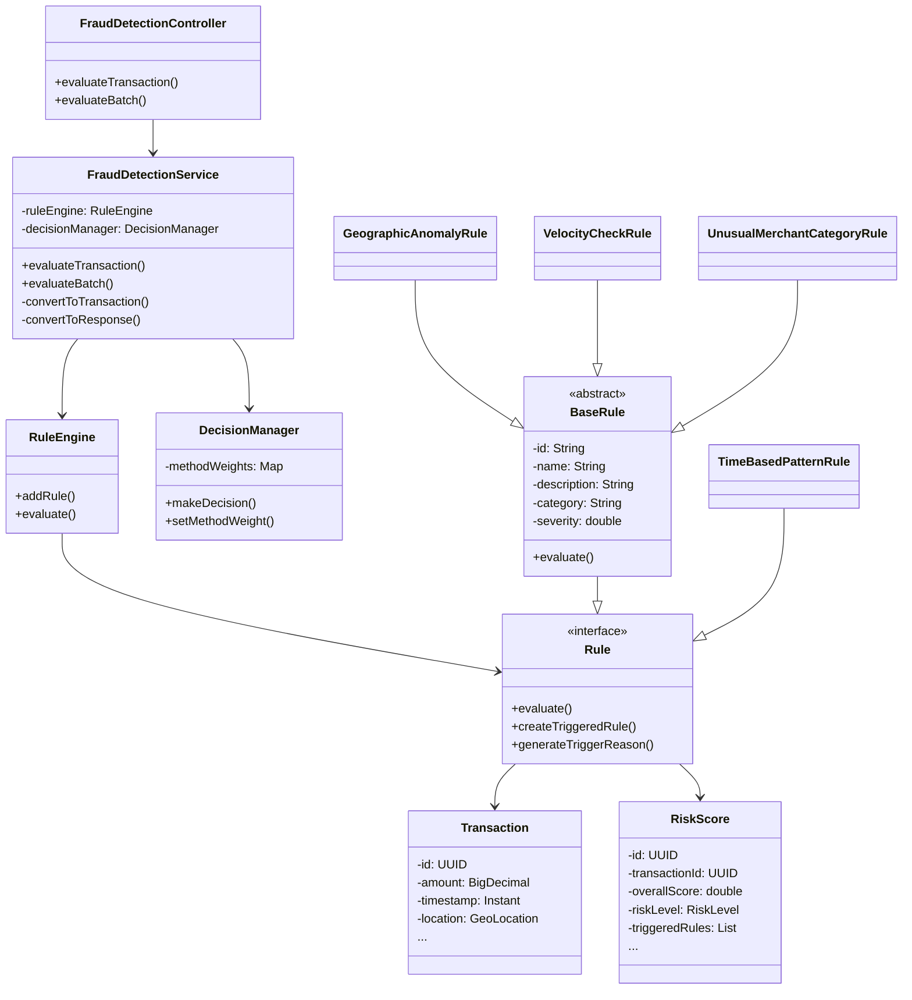
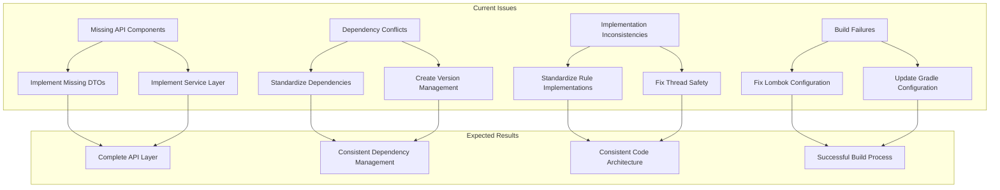

# Fraud Detection System: Architecture Overview

## High-Level Architecture



## Data Flow



## Component Relationships



## Package Structure

```
com.bragdev.fraud
├── api
│   ├── controller
│   │   └── FraudDetectionController
│   ├── dto
│   │   ├── DeviceInfoDto
│   │   ├── FraudDetectionRequest
│   │   ├── FraudDetectionResponse
│   │   ├── GeoLocationDto
│   │   ├── TransactionDto
│   │   ├── TransactionRiskDto
│   │   └── TriggeredRuleDto
│   └── service
│       └── FraudDetectionService
├── core
│   ├── engine
│   │   ├── RuleEngine (interface)
│   │   └── SimpleRuleEngine (implementation)
│   ├── model
│   │   ├── DeviceInfo
│   │   ├── GeoLocation
│   │   ├── RiskLevel (enum)
│   │   ├── RiskScore
│   │   ├── Transaction
│   │   ├── TransactionType (enum)
│   │   └── TriggeredRule
│   └── rule
│       ├── Rule (interface)
│       └── BaseRule (abstract)
├── decision
│   └── DecisionManager
└── detection
    ├── demo
    │   └── RuleEngineDemo
    └── rule
        ├── GeographicAnomalyRule
        ├── HighValueTransactionRule
        ├── TimeBasedPatternRule
        ├── UnusualMerchantCategoryRule
        └── VelocityCheckRule
```

## Current Issues and Fix Approach



## Detailed Documentation Index

We have created the following comprehensive documentation to address the fraud detection system issues:

1. **[Troubleshooting Plan](troubleshooting-plan.md)**: Technical analysis and solution approach
2. **[Implementation Steps](implementation-steps.md)**: Code-level implementation details
3. **[Dependency Analysis](dependency-analysis.md)**: In-depth dependency issue resolution
4. **[Testing Strategy](testing-strategy.md)**: Comprehensive testing approach
5. **[Execution Plan](execution-plan.md)**: Step-by-step implementation plan

## Implementation Timeline

```mermaid
gantt
    title Fraud Detection System Fix Implementation
    dateFormat  YYYY-MM-DD
    section Preparation
    Create Workspace Branch :a1, 2025-04-07, 1d
    Backup Current State    :a2, after a1, 1d
    section Core Fixes
    Fix Missing Components   :b1, 2025-04-07, 1d
    Fix Dependency Issues    :b2, 2025-04-08, 1d
    Fix Implementation Issues:b3, 2025-04-08, 1d
    section Validation
    Unit Testing            :c1, 2025-04-09, 1d
    Integration Testing     :c2, after c1, 1d
    Performance Optimization:c3, 2025-04-10, 1d
    section Finalization
    Documentation Update    :d1, 2025-04-10, 1d
    Final Validation        :d2, after d1, 1d
    Pull Request & Review   :d3, after d2, 1d