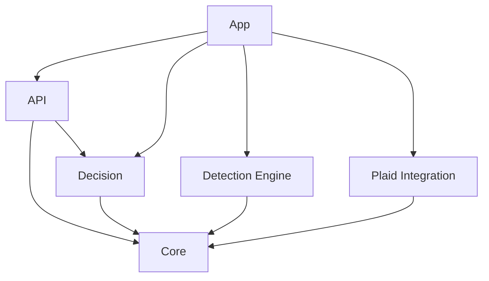
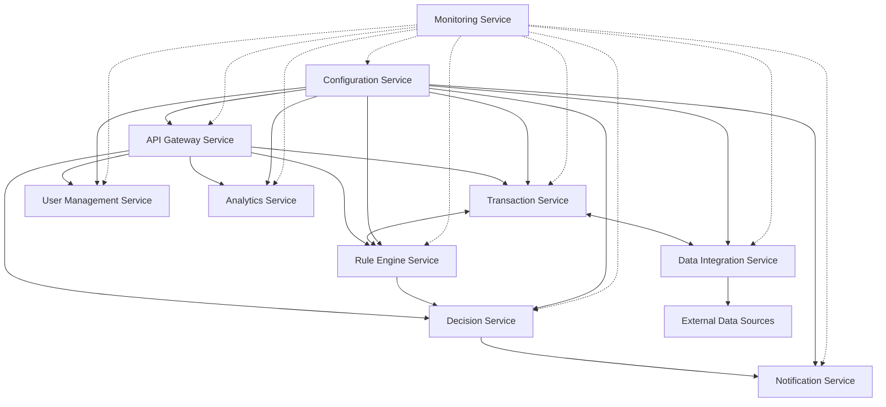
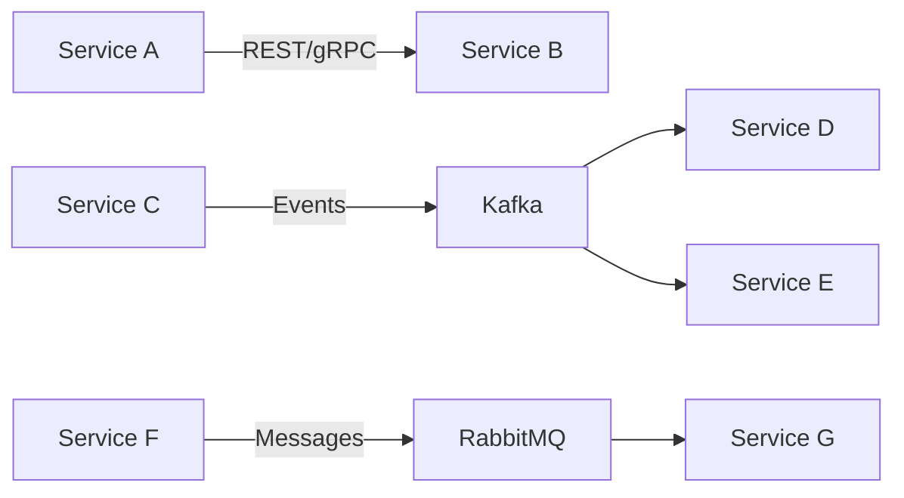

# Fraud Detection System: Microservices Migration Plan

## 1. Current Architecture Analysis

### 1.1 Existing Modules

From my analysis, I've identified the following key modules in the current system:

1. **API Module**: REST controllers and DTOs for external communication
2. **Core Module**: Domain models and shared interfaces
3. **Detection Engine Module**: Rule-based fraud detection implementation
4. **Decision Module**: Combines scores from different detection methods
5. **Plaid Integration Module**: Connects to Plaid's financial data APIs
6. **Ingestion Module**: Appears to be planned but not fully implemented
7. **Utilities Module**: Common utilities and helper functions
8. **App Module**: Main application entry point

### 1.2 Current Dependencies



### 1.3 Module Responsibilities

| Module | Responsibility |
|--------|----------------|
| API | Exposes REST endpoints for fraud detection, handles DTOs |
| Core | Defines domain models (Transaction, RiskScore, etc.) and interfaces |
| Detection Engine | Implements fraud detection rules and rule engine |
| Decision | Combines scores from different detection methods |
| Plaid Integration | Connects to Plaid's financial data APIs |
| Ingestion | Planned for data ingestion (not fully implemented) |
| Utilities | Common utilities and helper functions |
| App | Main application entry point and configuration |

## 2. Proposed Microservices Architecture

### 2.1 Microservice Identification

Based on the current modules and their responsibilities, I recommend the following microservices:

1. **API Gateway Service**: Entry point for all client requests, routing, and basic validation
2. **Transaction Service**: Manages transaction data and provides transaction-related operations
3. **Rule Engine Service**: Executes fraud detection rules on transactions
4. **Decision Service**: Combines scores from different detection methods
5. **Data Integration Service**: Handles integration with external data sources (including Plaid)
6. **Notification Service**: Manages alerts and notifications for detected fraud
7. **Analytics Service**: Provides reporting and analytics on fraud detection
8. **User Management Service**: Manages user accounts and authentication
9. **Configuration Service**: Centralized configuration management
10. **Monitoring Service**: System health monitoring and metrics

### 2.2 Microservice Responsibilities

#### 2.2.1 API Gateway Service
- Route requests to appropriate microservices
- Handle authentication and authorization
- Implement rate limiting and request validation
- Provide API documentation
- Implement circuit breaker patterns

#### 2.2.2 Transaction Service
- Store and retrieve transaction data
- Validate transaction data
- Provide transaction history
- Manage transaction metadata
- Handle transaction lifecycle

#### 2.2.3 Rule Engine Service
- Execute fraud detection rules
- Manage rule configurations
- Scale rule execution horizontally
- Provide rule evaluation results
- Support different types of rules (geographic, amount-based, etc.)

#### 2.2.4 Decision Service
- Combine scores from different detection methods
- Apply weighting to different detection methods
- Determine final risk level
- Provide decision explanations
- Support decision overrides

#### 2.2.5 Data Integration Service
- Connect to external data sources (Plaid, etc.)
- Transform external data to internal format
- Manage API keys and credentials
- Handle rate limiting for external APIs
- Provide data synchronization

#### 2.2.6 Notification Service
- Send alerts for high-risk transactions
- Manage notification preferences
- Support multiple notification channels (email, SMS, push)
- Handle notification delivery status
- Implement notification throttling

#### 2.2.7 Analytics Service
- Generate fraud detection reports
- Provide dashboards for fraud analysts
- Calculate fraud detection metrics
- Support data export
- Implement data aggregation

#### 2.2.8 User Management Service
- Manage user accounts
- Handle authentication and authorization
- Manage user roles and permissions
- Store user preferences
- Support user profile management

#### 2.2.9 Configuration Service
- Centralize configuration management
- Provide dynamic configuration updates
- Manage environment-specific configurations
- Support feature flags
- Handle configuration versioning

#### 2.2.10 Monitoring Service
- Monitor system health
- Collect performance metrics
- Generate alerts for system issues
- Provide logging infrastructure
- Support distributed tracing

### 2.3 Microservices Interaction Diagram



### 2.4 Mapping Current Modules to Microservices

| Current Module | Corresponding Microservice(s) |
|----------------|-------------------------------|
| API | API Gateway Service |
| Core | Shared libraries across services |
| Detection Engine | Rule Engine Service |
| Decision | Decision Service |
| Plaid Integration | Data Integration Service |
| Ingestion | Data Integration Service |
| Utilities | Shared libraries across services |
| App | Configuration Service |

## 3. Data Management Strategy

### 3.1 Database Per Service

Each microservice should have its own database to ensure loose coupling and independent scaling. Recommended database types:

| Microservice | Database Type | Justification |
|--------------|---------------|---------------|
| Transaction Service | PostgreSQL | ACID compliance for financial data |
| Rule Engine Service | MongoDB | Flexible schema for different rule types |
| Decision Service | PostgreSQL | Transactional integrity for decisions |
| Data Integration Service | MongoDB | Flexible schema for various data sources |
| Notification Service | Redis + PostgreSQL | Fast in-memory processing + persistence |
| Analytics Service | ClickHouse | Column-oriented for analytical queries |
| User Management Service | PostgreSQL | Relational data for user accounts |
| Configuration Service | Redis | Fast access to configuration data |
| Monitoring Service | Prometheus + InfluxDB | Time-series data for metrics |

### 3.2 Data Consistency

Implement eventual consistency between services using:
- Event-driven architecture with message queues
- Outbox pattern for reliable event publishing
- CQRS (Command Query Responsibility Segregation) where appropriate
- Saga pattern for distributed transactions

### 3.3 Data Migration Strategy

1. **Data Analysis**: Analyze existing data structures and relationships
2. **Schema Design**: Design new database schemas for each microservice
3. **Migration Scripts**: Develop scripts to migrate data from monolith to microservices
4. **Data Validation**: Implement validation to ensure data integrity during migration
5. **Incremental Migration**: Migrate data in batches to minimize risk
6. **Dual Write Period**: Maintain data consistency during transition period
7. **Verification**: Verify data consistency between old and new systems

## 4. Communication Patterns

### 4.1 Synchronous Communication

- REST APIs for simple request-response interactions
- gRPC for high-performance internal service communication
- GraphQL for flexible client queries (API Gateway)

### 4.2 Asynchronous Communication

- Kafka for event streaming and high-throughput messaging
- RabbitMQ for reliable message delivery
- Event-driven architecture for loose coupling



### 4.3 API Versioning

- Implement semantic versioning for all APIs
- Support multiple API versions during transition
- Use API gateways to route to appropriate version
- Implement backward compatibility where possible

## 5. Shared Resources and Libraries

### 5.1 Shared Libraries

Create the following shared libraries:

1. **Common Domain Models**: Core domain entities (Transaction, RiskScore, etc.)
2. **API Contracts**: Shared API definitions (OpenAPI/Swagger)
3. **Security Utilities**: Authentication and authorization utilities
4. **Logging Framework**: Standardized logging
5. **Metrics Framework**: Standardized metrics collection
6. **Exception Handling**: Common exception types and handlers
7. **Validation Utilities**: Common validation logic

### 5.2 Resource Sharing

Implement the following shared resources:

1. **Service Discovery**: Consul or Eureka for service registration and discovery
2. **API Gateway**: Spring Cloud Gateway or Kong
3. **Configuration Server**: Spring Cloud Config or HashiCorp Vault
4. **Message Broker**: Kafka or RabbitMQ
5. **Distributed Tracing**: Jaeger or Zipkin
6. **Metrics Collection**: Prometheus
7. **Log Aggregation**: ELK Stack (Elasticsearch, Logstash, Kibana)

## 6. Implementation Approach

### 6.1 Technology Stack

| Component | Technology | Justification |
|-----------|------------|---------------|
| Microservices Framework | Spring Boot | Current system already uses Spring |
| Service Discovery | Consul | Lightweight, supports health checks |
| API Gateway | Spring Cloud Gateway | Integrates well with Spring ecosystem |
| Message Broker | Kafka | High throughput for transaction processing |
| Containerization | Docker | Industry standard |
| Orchestration | Kubernetes | Scalability and self-healing |
| CI/CD | Jenkins or GitHub Actions | Automated deployment pipeline |
| Monitoring | Prometheus + Grafana | Comprehensive metrics and visualization |
| Logging | ELK Stack | Centralized logging and analysis |
| Tracing | Jaeger | Distributed tracing for request flows |

### 6.2 Implementation Phases

#### Phase 1: Foundation (2-3 months)
- Set up infrastructure (Kubernetes, CI/CD, monitoring)
- Implement shared libraries and resources
- Create service templates and standards
- Develop API Gateway and Configuration Service

#### Phase 2: Core Services (3-4 months)
- Implement Transaction Service
- Implement Rule Engine Service
- Implement Decision Service
- Implement User Management Service

#### Phase 3: Supporting Services (2-3 months)
- Implement Data Integration Service
- Implement Notification Service
- Implement Analytics Service
- Implement Monitoring Service

#### Phase 4: Migration and Testing (2-3 months)
- Migrate data from existing system
- Comprehensive testing (unit, integration, performance)
- Parallel running with existing system
- Gradual cutover to new system

### 6.3 Service Implementation Priority

| Priority | Service | Reasoning |
|----------|---------|-----------|
| 1 | Configuration Service | Foundation for other services |
| 2 | API Gateway Service | Entry point for all requests |
| 3 | Transaction Service | Core business functionality |
| 4 | Rule Engine Service | Core fraud detection capability |
| 5 | Decision Service | Required for complete fraud detection |
| 6 | Data Integration Service | External data integration |
| 7 | User Management Service | Authentication and authorization |
| 8 | Notification Service | Alerts for detected fraud |
| 9 | Analytics Service | Reporting and insights |
| 10 | Monitoring Service | System health and metrics |

## 7. Scalability Considerations

### 7.1 Horizontal Scaling

- Design all services to be stateless for horizontal scaling
- Use Kubernetes Horizontal Pod Autoscaler (HPA) for automatic scaling
- Implement database sharding for high-volume services (Transaction Service)
- Use read replicas for read-heavy services (Analytics Service)

### 7.2 Performance Optimization

- Implement caching at multiple levels (Redis, in-memory)
- Use connection pooling for database connections
- Optimize database queries and indexes
- Implement asynchronous processing for non-critical operations
- Use batch processing for high-volume operations

### 7.3 Load Testing

- Develop load testing scenarios for each service
- Test with projected transaction volumes
- Identify and address bottlenecks
- Validate scaling capabilities
- Simulate peak load conditions

## 8. Monitoring and Observability

### 8.1 Metrics

- System metrics: CPU, memory, disk, network
- Application metrics: Request rate, error rate, latency
- Business metrics: Fraud detection rate, false positive rate
- Custom metrics: Rule execution time, decision time

### 8.2 Logging

- Structured logging with consistent format
- Correlation IDs for request tracing
- Log aggregation with ELK Stack
- Log level management through configuration

### 8.3 Tracing

- Distributed tracing with Jaeger
- Trace sampling for high-volume services
- Trace context propagation across services
- Trace visualization and analysis

### 8.4 Alerting

- Alert on critical service failures
- Alert on performance degradation
- Alert on business metrics anomalies
- Alert on security incidents

### 8.5 Dashboards

- System health dashboards
- Service performance dashboards
- Business metrics dashboards
- Custom dashboards for specific use cases

## 9. Security Considerations

### 9.1 Authentication and Authorization

- OAuth 2.0 / OpenID Connect for authentication
- Role-based access control (RBAC)
- API keys for service-to-service communication
- JWT tokens with short expiration

### 9.2 Data Security

- Encryption at rest and in transit
- PII data handling according to regulations
- Secure secrets management with HashiCorp Vault
- Regular security scanning and testing

### 9.3 Network Security

- Network segmentation with Kubernetes namespaces
- Service mesh for secure service-to-service communication
- Network policies to restrict traffic
- API gateway for external access control

### 9.4 Compliance

- PCI DSS compliance for payment data
- GDPR compliance for personal data
- SOC 2 compliance for service organization controls
- Regular security audits and penetration testing

## 10. Migration Strategy

### 10.1 Data Migration

- Develop data migration scripts for each service
- Implement data validation and reconciliation
- Plan for downtime or read-only period during migration
- Create rollback procedures

### 10.2 Testing Strategy

- Unit testing for individual services
- Integration testing for service interactions
- End-to-end testing for critical flows
- Performance testing for scalability validation
- Chaos testing for resilience verification

### 10.3 Deployment Strategy

- Blue-green deployment for zero-downtime migration
- Canary releases for gradual rollout
- Feature flags for controlled feature activation
- Automated rollback procedures

### 10.4 Cutover Plan

1. **Preparation**: Ensure all services are deployed and tested
2. **Data Migration**: Migrate data to new services
3. **Parallel Running**: Run both systems in parallel
4. **Traffic Shifting**: Gradually shift traffic to new system
5. **Monitoring**: Monitor for issues during transition
6. **Fallback**: Maintain ability to revert to old system
7. **Decommissioning**: Remove old system after successful migration

## 11. Risks and Mitigation

| Risk | Impact | Mitigation |
|------|--------|------------|
| Increased complexity | High | Comprehensive documentation, training |
| Performance degradation | High | Performance testing, optimization |
| Data consistency issues | High | Event sourcing, saga pattern |
| Integration challenges | Medium | Clear API contracts, versioning |
| Operational overhead | Medium | Automation, monitoring, self-healing |
| Security vulnerabilities | High | Security by design, regular audits |
| Migration failures | High | Thorough testing, rollback procedures |
| Team skill gaps | Medium | Training, hiring, external expertise |
| Timeline slippage | Medium | Agile approach, regular reassessment |
| Budget overruns | Medium | Phased approach, regular cost reviews |

## 12. Success Criteria

The microservices migration will be considered successful when:

1. All functionality from the existing system is available in the new architecture
2. The system can scale to handle projected transaction volumes
3. Individual services can be scaled independently
4. System performance meets or exceeds current performance
5. Monitoring and observability provide comprehensive insights
6. Deployment and operations processes are automated
7. Security controls meet or exceed current standards
8. Maintenance and feature development are more efficient

## 13. Next Steps

1. **Detailed Design**: Create detailed design documents for each microservice
2. **Infrastructure Setup**: Set up Kubernetes cluster and CI/CD pipeline
3. **Prototype**: Develop prototype of key services
4. **Team Organization**: Organize teams around microservices
5. **Training**: Train teams on microservices architecture and technologies
6. **Implementation**: Begin implementation according to phased approach
7. **Regular Reviews**: Conduct regular architecture reviews during implementation

## Appendix A: Microservice API Contracts

### A.1 Transaction Service API

```yaml
openapi: 3.0.0
info:
  title: Transaction Service API
  version: 1.0.0
paths:
  /transactions:
    post:
      summary: Create a new transaction
      # ... details omitted for brevity
    get:
      summary: Get transactions with filtering
      # ... details omitted for brevity
  /transactions/{id}:
    get:
      summary: Get transaction by ID
      # ... details omitted for brevity
```

### A.2 Rule Engine Service API

```yaml
openapi: 3.0.0
info:
  title: Rule Engine Service API
  version: 1.0.0
paths:
  /rules:
    get:
      summary: Get all rules
      # ... details omitted for brevity
    post:
      summary: Create a new rule
      # ... details omitted for brevity
  /rules/{id}:
    get:
      summary: Get rule by ID
      # ... details omitted for brevity
  /evaluate:
    post:
      summary: Evaluate transaction against rules
      # ... details omitted for brevity
```

## Appendix B: Microservice Database Schemas

### B.1 Transaction Service Schema

```sql
CREATE TABLE transactions (
  id UUID PRIMARY KEY,
  account_id VARCHAR(255) NOT NULL,
  amount DECIMAL(19, 4) NOT NULL,
  currency VARCHAR(3) NOT NULL,
  merchant_id VARCHAR(255),
  merchant_name VARCHAR(255),
  merchant_category VARCHAR(255),
  timestamp TIMESTAMP NOT NULL,
  channel VARCHAR(50),
  transaction_type VARCHAR(50) NOT NULL,
  received_at TIMESTAMP NOT NULL,
  transaction_reference VARCHAR(255),
  created_at TIMESTAMP NOT NULL,
  updated_at TIMESTAMP NOT NULL
);

CREATE INDEX idx_transactions_account_id ON transactions(account_id);
CREATE INDEX idx_transactions_timestamp ON transactions(timestamp);
```

### B.2 Rule Engine Service Schema

```javascript
// MongoDB Schema (represented in JSON)
{
  "rules": {
    "id": "String",
    "name": "String",
    "description": "String",
    "category": "String",
    "severity": "Number",
    "parameters": "Object",
    "implementation": "String",
    "active": "Boolean",
    "created_at": "Date",
    "updated_at": "Date"
  }
}
```

## Appendix C: Event Schema Definitions

### C.1 Transaction Created Event

```json
{
  "event_type": "transaction_created",
  "version": "1.0",
  "timestamp": "2025-04-07T10:15:30Z",
  "transaction_id": "123e4567-e89b-12d3-a456-426614174000",
  "account_id": "ACC1234",
  "amount": 100.00,
  "currency": "USD",
  "merchant_name": "Example Merchant",
  "transaction_type": "PURCHASE"
}
```

### C.2 Fraud Detection Event

```json
{
  "event_type": "fraud_detected",
  "version": "1.0",
  "timestamp": "2025-04-07T10:15:35Z",
  "transaction_id": "123e4567-e89b-12d3-a456-426614174000",
  "risk_score": 85.5,
  "risk_level": "HIGH",
  "triggered_rules": [
    {
      "rule_id": "UNUSUAL_LOCATION",
      "severity": 80.0,
      "reason": "Transaction location is 5000 km from customer's normal location"
    }
  ]
}