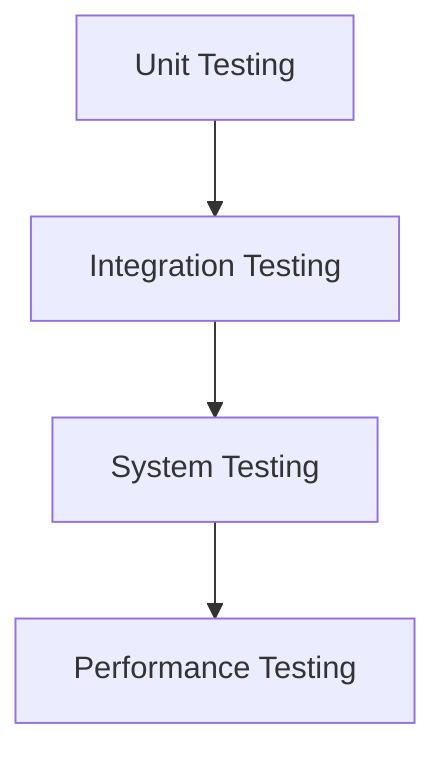

# Fraud Detection System: Testing Strategy

## Testing Goals

1. Verify all build and dependency issues are resolved
2. Confirm that API endpoints function correctly
3. Validate that rules are properly applied
4. Ensure thread safety in multi-threaded contexts
5. Verify integration with external systems

## Testing Levels



## 1. Unit Testing

### Core Module Tests

| Test Target | Test Focus | Test Methods |
|-------------|------------|--------------|
| Transaction | Proper construction and field access | Test constructors, getters, setters |
| RiskScore | Calculation of risk levels | Test risk level calculations |
| GeoLocation | Distance calculation | Test distance calculations |
| Rule implementations | Rule evaluation logic | Test with various transaction scenarios |

Example for GeoLocation test:

```java
@Test
public void testDistanceCalculation() {
    GeoLocation nyc = new GeoLocation(40.7128, -74.0060);
    GeoLocation la = new GeoLocation(34.0522, -118.2437);
    
    double distance = nyc.distanceFrom(la);
    
    // Approximate distance between NYC and LA is ~3,944 km
    assertEquals(3944.0, distance, 100.0); // Allow 100km tolerance
}
```

### Rule Engine Tests

| Test Target | Test Focus | Test Methods |
|-------------|------------|--------------|
| SimpleRuleEngine | Rule evaluation | Test with mock rules |
| RuleEngineDemo | Configuration | Verify all rules are properly added |
| Individual rules | Rule triggering | Test boundary conditions |

Example for GeographicAnomalyRule test:

```java
@Test
public void testGeographicAnomalyRule() {
    // Reference location in New York
    GeoLocation referenceLocation = new GeoLocation(40.7128, -74.0060);
    
    // Set threshold to 1000 km
    GeographicAnomalyRule rule = new GeographicAnomalyRule(referenceLocation, 1000.0);
    
    // Create transaction in LA (> 1000 km away)
    Transaction farTransaction = Transaction.builder()
            .id(UUID.randomUUID())
            .location(new GeoLocation(34.0522, -118.2437))
            .build();
    
    // Create transaction in Boston (< 1000 km away)
    Transaction nearTransaction = Transaction.builder()
            .id(UUID.randomUUID())
            .location(new GeoLocation(42.3601, -71.0589))
            .build();
    
    // Test rule evaluation
    assertTrue(rule.evaluate(farTransaction));
    assertFalse(rule.evaluate(nearTransaction));
    
    // Test triggered rule creation
    assertNotNull(rule.createTriggeredRule(farTransaction));
    assertNull(rule.createTriggeredRule(nearTransaction));
}
```

### Service Layer Tests

| Test Target | Test Focus | Test Methods |
|-------------|------------|--------------|
| FraudDetectionService | DTO conversion | Test mapping between DTOs and domain objects |
| FraudDetectionService | Rule evaluation | Test service with mock rule engine |
| FraudDetectionService | Batch processing | Test with multiple transactions |

Example for FraudDetectionService test:

```java
@Test
public void testEvaluateTransaction() {
    // Mock dependencies
    RuleEngine mockRuleEngine = mock(RuleEngine.class);
    DecisionManager mockDecisionManager = mock(DecisionManager.class);
    
    // Create test data
    TransactionDto dto = new TransactionDto();
    dto.setId(UUID.randomUUID().toString());
    dto.setAmount(new BigDecimal("100.00"));
    
    // Set up mocks
    RiskScore mockScore = new RiskScore();
    mockScore.setOverallScore(75.0);
    mockScore.setRiskLevel(RiskLevel.HIGH);
    
    when(mockRuleEngine.evaluate(any(Transaction.class))).thenReturn(mockScore);
    when(mockDecisionManager.makeDecision(any(Transaction.class), anyMap())).thenReturn(mockScore);
    
    // Initialize service with mocks
    FraudDetectionService service = new FraudDetectionService(mockRuleEngine, mockDecisionManager);
    
    // Test
    FraudDetectionResponse response = service.evaluateTransaction(dto);
    
    // Verify
    assertNotNull(response);
    assertEquals(75.0, response.getRiskScore(), 0.01);
    assertEquals("HIGH", response.getRiskLevel());
}
```

## 2. Integration Testing

### API to Rule Engine Integration

| Test Focus | Test Scenario | Expected Result |
|------------|---------------|-----------------|
| Single transaction evaluation | Valid transaction with various risk factors | Appropriate risk score is returned |
| Batch evaluation | Multiple transactions with varying risk levels | Each transaction is properly evaluated |
| Edge cases | Null values, extreme values | Proper error handling |

Example test:

```java
@SpringBootTest
@AutoConfigureMockMvc
public class FraudDetectionControllerIntegrationTest {
    
    @Autowired
    private MockMvc mockMvc;
    
    @Test
    public void testEvaluateEndpoint() throws Exception {
        // Create test request
        FraudDetectionRequest request = new FraudDetectionRequest();
        TransactionDto dto = new TransactionDto();
        dto.setAmount(new BigDecimal("5000.00")); // High amount to trigger rules
        request.setTransaction(dto);
        
        // Convert to JSON
        String requestJson = new ObjectMapper().writeValueAsString(request);
        
        // Perform the request
        mockMvc.perform(post("/api/v1/fraud-detection/evaluate")
                .contentType(MediaType.APPLICATION_JSON)
                .content(requestJson))
                .andExpect(status().isOk())
                .andExpect(jsonPath("$.riskLevel").value("HIGH"));
    }
}
```

### Rule Engine to Decision Manager Integration

Test the complete flow from rule evaluation through decision-making:

```java
@Test
public void testRuleEngineWithDecisionManager() {
    // Initialize components
    RuleEngine engine = RuleEngineDemo.createStandardRuleEngine();
    DecisionManager decisionManager = new DecisionManager();
    
    // Create high-risk transaction
    Transaction transaction = Transaction.builder()
            .id(UUID.randomUUID())
            .amount(new BigDecimal("10000.00"))
            .currency("USD")
            .build();
    
    // Evaluate with rule engine
    RiskScore ruleEngineScore = engine.evaluate(transaction);
    
    // Pass to decision manager
    Map<String, RiskScore> scores = new HashMap<>();
    scores.put("RULE_ENGINE", ruleEngineScore);
    RiskScore finalScore = decisionManager.makeDecision(transaction, scores);
    
    // Verify
    assertNotNull(finalScore);
    assertEquals(RiskLevel.HIGH, finalScore.getRiskLevel());
}
```

## 3. Thread Safety Testing

### Concurrent Rule Evaluation

Test VelocityCheckRule with concurrent transactions:

```java
@Test
public void testVelocityCheckRuleConcurrency() throws InterruptedException {
    // Initialize rule
    VelocityCheckRule rule = new VelocityCheckRule(Duration.ofMinutes(5), 3);
    
    // Create transactions for same account
    String accountId = "TEST-ACCOUNT-123";
    
    // Create executor with multiple threads
    ExecutorService executor = Executors.newFixedThreadPool(10);
    CountDownLatch latch = new CountDownLatch(20);
    
    // Submit 20 concurrent evaluations
    for (int i = 0; i < 20; i++) {
        int finalI = i;
        executor.submit(() -> {
            try {
                Transaction tx = Transaction.builder()
                        .id(UUID.randomUUID())
                        .accountId(accountId)
                        .timestamp(Instant.now().plusMillis(finalI * 100)) // Slight time difference
                        .build();
                
                boolean result = rule.evaluate(tx);
                
                // After 3 transactions, rule should start triggering
                if (finalI > 3) {
                    assertTrue(result);
                }
            } finally {
                latch.countDown();
            }
        });
    }
    
    // Wait for all tasks to complete
    latch.await(10, TimeUnit.SECONDS);
    executor.shutdown();
    
    // Verify final state
    Transaction finalTx = Transaction.builder()
            .id(UUID.randomUUID())
            .accountId(accountId)
            .timestamp(Instant.now())
            .build();
    
    assertTrue(rule.evaluate(finalTx));
}
```

## 4. Performance Testing

### Rule Engine Performance

Test the performance of the rule engine with varying numbers of rules and transactions:

```java
@Test
public void testRuleEnginePerformance() {
    // Initialize rule engine with 10 rules
    RuleEngine engine = new SimpleRuleEngine();
    for (int i = 0; i < 10; i++) {
        engine.addRule(new HighValueTransactionRule(new BigDecimal((i + 1) * 1000), "USD"));
    }
    
    // Create 1000 test transactions
    List<Transaction> transactions = new ArrayList<>();
    for (int i = 0; i < 1000; i++) {
        transactions.add(Transaction.createSample());
    }
    
    // Measure evaluation time
    long startTime = System.currentTimeMillis();
    
    for (Transaction tx : transactions) {
        engine.evaluate(tx);
    }
    
    long endTime = System.currentTimeMillis();
    long duration = endTime - startTime;
    
    // Performance assertion - should evaluate 1000 transactions in under 1 second
    assertTrue(duration < 1000);
}
```

## 5. System Testing

### Complete Flow Test

Test the complete system from API request to response:

```java
@SpringBootTest
@AutoConfigureMockMvc
public class CompleteSystemTest {
    
    @Autowired
    private MockMvc mockMvc;
    
    @Test
    public void testCompleteFlow() throws Exception {
        // Create a batch of transactions with varying risk levels
        FraudDetectionRequest request = new FraudDetectionRequest();
        List<TransactionDto> transactions = new ArrayList<>();
        
        // Low risk transaction
        TransactionDto lowRisk = new TransactionDto();
        lowRisk.setAmount(new BigDecimal("50.00"));
        lowRisk.setCurrency("USD");
        lowRisk.setMerchantCategory("GROCERY");
        transactions.add(lowRisk);
        
        // High risk transaction
        TransactionDto highRisk = new TransactionDto();
        highRisk.setAmount(new BigDecimal("9999.99"));
        highRisk.setCurrency("USD");
        highRisk.setMerchantCategory("GAMBLING");
        transactions.add(highRisk);
        
        request.setTransactions(transactions);
        
        // Convert to JSON
        String requestJson = new ObjectMapper().writeValueAsString(request);
        
        // Perform the request
        mockMvc.perform(post("/api/v1/fraud-detection/evaluate-batch")
                .contentType(MediaType.APPLICATION_JSON)
                .content(requestJson))
                .andExpect(status().isOk())
                .andExpect(jsonPath("$.results", hasSize(2)))
                .andExpect(jsonPath("$.results[0].riskLevel").value("LOW"))
                .andExpect(jsonPath("$.results[1].riskLevel").value("HIGH"));
    }
}
```

## 6. Dependency Validation Tests

### Build Validation

```bash
# Script to validate build with each fix
#!/bin/bash

echo "Running dependency validation tests..."

# Test 1: Verify clean build
./gradlew clean build --refresh-dependencies > build_output.log
BUILD_RESULT=$?

if [ $BUILD_RESULT -ne 0 ]; then
    echo "Build failed! Check build_output.log for details."
    exit 1
fi

# Test 2: Check for dependency conflicts
./gradlew dependencyInsight --dependency lombok > lombok_deps.log
grep -i conflict lombok_deps.log
LOMBOK_CONFLICTS=$?

if [ $LOMBOK_CONFLICTS -eq 0 ]; then
    echo "Lombok dependency conflicts detected!"
    exit 1
fi

# Test 3: Verify Spring Boot managed dependencies
./gradlew :api:dependencies > api_deps.log
grep -i "org.springframework.boot:" api_deps.log | grep -v "FAILED"
SPRING_DEPS=$?

if [ $SPRING_DEPS -ne 0 ]; then
    echo "Spring Boot dependency management issues detected!"
    exit 1
fi

echo "All dependency validation tests passed!"
```

## Test Coverage Goals

| Module | Test Coverage Goal |
|--------|-------------------|
| Core | 90% |
| Rule implementations | 95% |
| Service layer | 85% |
| API controllers | 80% |
| Integration tests | Key workflows |

## Testing Timeline

1. **Unit Tests**: Implement alongside code changes - Day 1-2
2. **Integration Tests**: Implement after unit tests - Day 2-3
3. **Thread Safety Tests**: Implement after basic functionality works - Day 3
4. **Performance Tests**: Implement last - Day 4
5. **Full System Tests**: Final validation - Day 5

## Testing Tools

1. **JUnit 5**: Core testing framework
2. **Mockito**: For mocking dependencies
3. **Spring Test**: For Spring component testing
4. **AssertJ**: For fluent assertions
5. **JaCoCo**: For test coverage reporting

## Automated CI Pipeline Recommendations

```yaml
# Recommended CI Pipeline stages
stages:
  - compile
  - unit-test
  - integration-test
  - dependency-check
  - performance-test
  - package
  - deploy-test

# Example job configurations
compile:
  stage: compile
  script:
    - ./gradlew compileJava compileTestJava

unit-test:
  stage: unit-test
  script:
    - ./gradlew test
  artifacts:
    paths:
      - "**/build/test-results/test/*.xml"

integration-test:
  stage: integration-test
  script:
    - ./gradlew integrationTest
  artifacts:
    paths:
      - "**/build/test-results/integrationTest/*.xml"

dependency-check:
  stage: dependency-check
  script:
    - ./gradlew dependencyCheckAnalyze
  artifacts:
    paths:
      - "**/build/reports/dependency-check-report.html"

performance-test:
  stage: performance-test
  script:
    - ./gradlew jmhJar jmh
  artifacts:
    paths:
      - "**/build/reports/jmh/results.txt"
```

## Success Criteria

The testing is considered successful when:

1. All unit tests pass with >85% code coverage
2. All integration tests pass
3. The system can handle 100 concurrent transaction evaluations
4. Rule evaluation time is under 50ms per transaction
5. No dependency conflicts are reported
6. The system builds without warnings